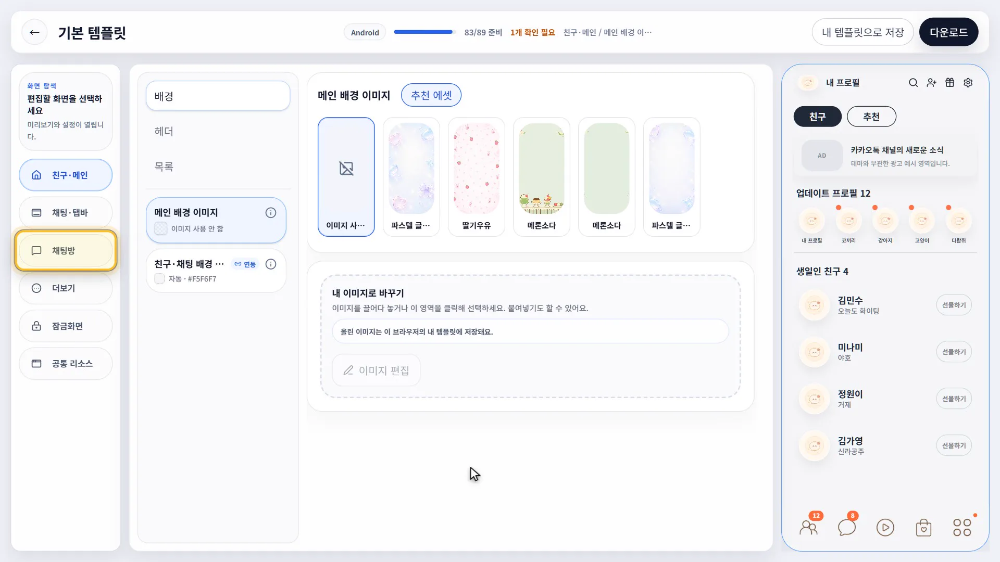

# TalkTheme — 카카오톡 테마 메이커

**이미지와 색상을 편집해 Android·iOS 카카오톡 테마를 만드는 웹 서비스입니다.**

[서비스 바로가기](https://talktheme.shop)

> **역할:** 1인 개발 · **기간:** 2026.06 ~ 현재

## 프로젝트 배경

카카오톡 테마는 이미지 편집만으로 완성되지 않습니다. Android는 리소스 구성과 APK 빌드·서명이 필요하고, iOS는 별도의 테마 패키지 형식을 따라야 합니다.

이 제작 과정을 **템플릿 선택 → 편집 → 미리보기 → 내보내기**로 연결해, 사용자가 브라우저에서 테마를 만들 수 있도록 개발했습니다.

## 주요 기능

- **템플릿 기반 편집:** 템플릿의 이미지와 화면별 색상을 변경합니다.
- **말풍선 편집:** 늘어나는 영역을 지정하는 Android 이미지 형식인 `.9.png`의 영역을 조정합니다.
- **테마 미리보기:** 편집한 이미지와 색상을 화면에서 확인합니다.
- **Android·iOS 내보내기:** Android APK와 iOS `.ktheme` 파일을 생성합니다.
- **계정·결제:** 로그인, 크레딧 구매와 내보내기 이력을 제공합니다.

## 기술 구성

| 영역 | 사용 기술 |
| --- | --- |
| 웹 애플리케이션 | Next.js 15, React 19, TypeScript |
| 스타일 | Tailwind CSS 4 |
| 인증·데이터·에셋 저장 | Supabase |
| 웹 서비스 실행 | Cloudflare Workers, OpenNext |
| 테마 패키지 생성 | GCP Cloud Run Jobs, Cloud Storage |
| 결제 연동 | Groble |
| 운영 알림·감시 | Telegram, Cloud Run, Cloud Scheduler, Cloud Monitoring |
| 테스트 | Vitest, Testing Library, Playwright |

## 주요 설계와 선택 이유

### 미리보기와 내보내기의 상태 공유

미리보기와 패키징이 이미지를 따로 선택하면 “화면에서는 맞는데 받은 테마는 다르다”는 문제가 생길 수 있습니다.

이미지 선택, 업로드, 색상, 말풍선 편집 값을 공통 프로젝트 상태로 관리하고, 미리보기와 내보내기가 같은 규칙으로 리소스를 결정하도록 구성했습니다. 브라우저와 빌더의 이미지 변환 결과가 같은지 브라우저 테스트로 확인합니다.

### 기본 템플릿과 사용자 수정의 분리

템플릿 전체를 복사해 수정하면 원본과 사용자 변경의 경계가 흐려지고, 같은 데이터가 여러 곳에서 관리됩니다.

프로젝트를 `baseTemplateId + overrides`로 표현해 기본 템플릿을 보존하면서 변경 사항만 관리합니다. 시스템 템플릿과 사용자 로컬 템플릿도 별도의 저장 경로를 사용합니다.

### 웹 요청과 플랫폼별 빌드의 분리

Cloudflare Workers에서는 Android 빌드 도구를 실행할 수 없고, 요청당 CPU 제한도 있습니다. 패키지 생성을 웹 요청 안에서 처리하기에는 실행 환경과 작업 비용이 맞지 않았습니다.

웹 서비스는 입력과 작업 상태를 관리하고, Android·iOS 빌더는 Cloud Run Jobs에서 실행하도록 분리했습니다. Cloud Storage로 입력과 결과물을 전달해 웹 런타임과 빌드 환경을 독립적으로 구성했습니다.

### 비동기 작업과 조건부 크레딧 정산

네트워크가 끊기면 빌드 요청이 실제로 접수됐는지 알기 어렵습니다. 이때 요청을 무조건 다시 보내거나 정산을 반복하면 중복 빌드와 크레딧 오정산이 발생할 수 있습니다.

복구 전에는 기존 빌드 실행 이력을 먼저 확인하고, 확인이 불완전하면 다시 요청하지 않고 대기합니다. 완료·실패·취소 정산은 작업 행을 잠근 뒤 대기 상태일 때만 전이하도록 처리해, 동시 요청에서도 크레딧이 두 번 차감되거나 환급되지 않게 했습니다.

### 장애 감시와 진단

웹 서비스나 DB가 멈추면 그 안에서 실행하는 감시와 알림도 함께 실패할 수 있습니다.

별도의 GCP 감시 서비스가 Cloud Run과 Scheduler를 통해 **5분 주기**로 사이트 응답, DB 연결(Data API 조회)과 Workers 런타임 오류 후보를 확인합니다. 감시 서비스 자체가 멈추면 Cloud Monitoring이 별도 이메일로 알리도록 구성했고, 운영 연결과 알림 수신을 검증했습니다.

애플리케이션에서는 요청 상관 ID, 실패 단계와 의존 서비스를 기록합니다. 민감정보는 로그에서 제외하고, 반복 오류 알림은 묶되 결제·환급 사건은 개별 식별자를 유지합니다.

## 구현 과정에서 다룬 문제

### Workers Free 호출 예산

내보내기 복구에는 인증, 실행 이력 조회, 정산과 알림 등 여러 외부 호출이 필요합니다.

정산과 다운로드 URL 서명을 분리하고, 빌더 인증 토큰을 만료 전까지 재사용하며, sweep 처리량과 실행 이력 조회에 상한을 두었습니다. 호출 예산을 줄이는 대신 백그라운드 처리량이 낮아지는 절충도 함께 관리했습니다.

### 관측 공백과 잘못된 복구 판단

장애 감시에서 데이터가 없는 구간을 정상으로 취급하거나, 공백 전후의 정상 관측을 연속 성공으로 세면 잘못된 복구 알림이 발생합니다.

실패·정상·알 수 없음을 구분하고, 관측 공백이 연속 성공·실패 카운트를 끊도록 수정했습니다. 수집 성공과 과거 데이터 누락도 분리해, 수집기가 정상화된 뒤 재시도 대기 상태에 계속 머무르지 않도록 했습니다.

## 검증과 배포

- **단위 테스트:** 테마 로직, 작업 상태 전이, 정산·취소·복구와 감시 경로를 검증합니다.
- **계약 검사 7종:** 텍스트 인코딩, 플랫폼별 슬롯·에셋·패키징, Edge import와 관리자 에셋 계약을 검사합니다.
- **서비스별 타입 검사:** 웹 애플리케이션 외에 Android·iOS 빌더와 감시 서비스를 각각 검사합니다.
- **PR 검증:** TypeScript, lint, 단위 테스트와 계약 검사를 실행합니다.
- **브라우저 검증:** main 병합 후 Playwright로 편집기 초기화, 자동 저장, 내보내기 이력, 페이지 이동과 미리보기·빌더 이미지 변환 일치를 검사합니다.
- **배포:** 리뷰와 CI를 통과한 변경을 main에 병합한 뒤 Cloudflare Workers Builds로 배포합니다.

## 코드 구조

| 경로 | 역할 |
| --- | --- |
| `app/` | 페이지와 API 라우트 |
| `components/project/` | 테마 편집기와 내보내기 UI |
| `components/preview/` | 테마 화면 미리보기 |
| `lib/theme/` | 테마 모델, 프로젝트 상태와 플랫폼별 패키징 |
| `lib/billing/` | 결제와 크레딧 정산 |
| `lib/ops/` | 요청 진단과 운영 알림 |
| `services/android-builder/` | Android 테마 빌더 |
| `services/ios-builder/` | iOS 테마 빌더 |
| `services/runtime-monitor/` | 독립 장애 감시 |
| `supabase/migrations/` | 데이터베이스 변경 이력 |
| `e2e/` | 브라우저 시나리오 테스트 |

---

카카오와 무관한 개인 프로젝트입니다.
