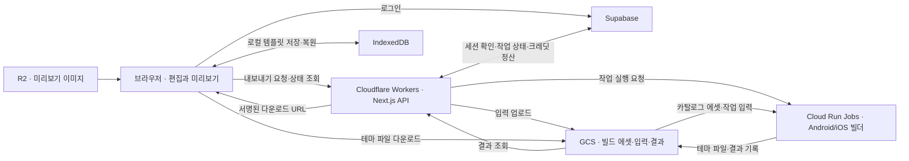

# TalkTheme — 카카오톡 테마 메이커

**템플릿에 좋아하는 사진이나 이미지를 넣어 나만의 Android·iOS 카카오톡 테마를 만드는 웹 서비스입니다.**

[서비스 바로가기](https://talktheme.shop)

> **역할:** 1인 개발 · **기간:** 2026.06 ~ 현재

## 프로젝트 배경

반려동물 사진, 좋아하는 캐릭터, 직접 그린 그림을 카카오톡 테마로 쓰고 싶어도 이미지만으로는 테마를 완성하기 어렵습니다. Android는 리소스 구성과 APK 빌드·서명이 필요하고, iOS는 별도의 테마 패키지 형식을 따라야 합니다.

이 제작 과정을 **템플릿 선택 → 내 이미지 업로드·편집 → 미리보기 → 내보내기**로 연결했습니다. 사용자는 템플릿을 바탕으로 원하는 이미지를 배치하고 색상과 말풍선을 조정해, 브라우저에서 자신만의 테마를 만들 수 있습니다.

## 주요 기능

- **내 이미지로 테마 제작:** 사진이나 그림을 업로드해 배경, 아이콘, 말풍선 등 원하는 테마 요소에 적용합니다.
- **템플릿 기반 편집:** 템플릿을 바탕으로 이미지를 배치하고 화면별 색상을 변경합니다.
- **말풍선 편집:** 늘어나는 영역을 지정하는 Android 이미지 형식인 `.9.png`의 영역을 조정합니다.
- **테마 미리보기:** 편집한 이미지와 색상을 화면에서 확인합니다.
- **Android·iOS 내보내기:** Android APK와 iOS `.ktheme` 파일을 생성합니다.
- **계정·결제:** 로그인, 크레딧 구매와 내보내기 이력을 제공합니다.

## 기술 구성

| 영역 | 사용 기술 |
| --- | --- |
| 웹 애플리케이션 | Next.js 15, React 19, TypeScript |
| 스타일 | Tailwind CSS 4 |
| 인증·업무 데이터 | Supabase Auth, PostgreSQL |
| 에셋·파일 저장 | Supabase Storage, Cloudflare R2, Google Cloud Storage(GCS) |
| 브라우저 로컬 저장 | IndexedDB |
| 웹 서비스 실행 | Cloudflare Workers, OpenNext |
| 테마 패키지 생성 | GCP Cloud Run Jobs |
| 결제 연동 | Groble |
| 사용자 행동 분석 | Google Analytics 4(GA4), GA4 Data API(선택적 연동) |
| 운영 알림·감시 | Telegram, Cloud Run, Cloud Scheduler, Cloud Monitoring |
| 테스트 | Vitest, Testing Library, Playwright |

## 아키텍처

### 편집부터 내보내기까지

브라우저는 테마 편집과 미리보기, Supabase 로그인을 담당하고, Cloudflare Workers의 API가 세션 확인, 작업 예약과 상태 조회를 처리합니다. 패키지 생성은 별도의 Android·iOS 빌더가 Cloud Run Jobs에서 수행합니다.

Cloudflare Workers에서 Android 빌드 도구를 실행할 수 없고 요청당 CPU 제한도 있으므로, 웹 요청 처리와 패키지 생성 환경을 분리했습니다. GCS로 입력과 결과물을 전달하며, 사용자는 작업 상태를 조회하고 완료된 파일을 다운로드합니다.

### 용도별 저장소 분리

에셋을 관리하는 데이터, 화면에 제공하는 이미지, 빌드가 사용하는 파일은 접근 방식과 용도가 다르므로 저장 경로를 나눴습니다.

| 저장소 | 역할 |
| --- | --- |
| Supabase | 인증과 업무 데이터·에셋 메타데이터 관리, Storage를 통한 관리용 원본 저장 |
| Cloudflare R2 | 화면에 제공하는 미리보기·썸네일 파생 이미지 저장과 제공 |
| GCS | 빌드용 카탈로그 에셋, 작업 입력과 생성 결과물 저장 |

카탈로그 게시 시 GCS·R2 객체를 검증한 뒤 DB의 활성 참조를 갱신합니다. R2 미리보기 경로가 없는 에셋은 기존 Supabase 경로를 사용합니다. 사용자 로컬 템플릿, 업로드 이미지와 자동 저장 초안은 브라우저의 IndexedDB에 보관하며 계정 간 동기화는 제공하지 않습니다. 내보내기 때 필요한 입력을 빌드 경로로 전달합니다.

### 공통 프로젝트 상태와 템플릿

이미지 선택, 업로드, 색상, 말풍선 편집 값을 공통 프로젝트 상태로 관리합니다. 미리보기와 내보내기가 같은 규칙으로 리소스를 결정하게 해 화면과 결과물의 차이를 줄이고, 브라우저와 빌더의 이미지 변환 결과 일치를 브라우저 테스트로 확인합니다.

시스템 템플릿은 `baseTemplateId + overrides`로 표현하고, 사용자 로컬 템플릿은 템플릿 ID와 이미지·색상·선택·말풍선 변경 값을 저장해 기본 템플릿을 보존합니다. 시스템 템플릿과 사용자 로컬 템플릿도 별도의 저장 경로를 사용합니다.

### 비동기 작업과 조건부 크레딧 정산

네트워크가 끊겨 빌드 접수 여부가 불확실한 경우에는 기존 빌드 실행 이력을 먼저 확인합니다. 실행 이력 검색이 끝까지 완료되지 않으면 다시 요청하지 않고 대기하며, watchdog 제한 시간을 넘긴 작업은 조건부 실패 정산으로 크레딧을 환급합니다. 일반 조회 장애는 시간 초과로 간주해 자동 환급하지 않습니다.

완료·실패·취소 정산은 작업 행을 잠근 뒤 대기 상태일 때만 전이하도록 처리해, 동시 요청에서도 크레딧이 두 번 차감되거나 환급되지 않게 했습니다.

### 사용자 행동 분석

GA4로 페이지 조회, 템플릿 선택, 편집기 진입, 내보내기와 결제 관련 이벤트를 수집해 사용 흐름을 분석합니다. 분석에 동의한 사용자의 이벤트만 전송하며, 개발·미리보기 환경에서는 수집을 비활성화하고 관리자로 확인된 기기의 이벤트에는 내부 트래픽 표시를 붙여 GA4 필터로 구분할 수 있게 합니다. 유입 정보는 허용된 캠페인 값만 전달합니다.

관리자 콘솔의 가입·내보내기·결제 건수는 DB 기록을 기준으로 집계합니다. GA4 행동 분석과 업무 집계를 구분하며, GA4 Data API가 설정된 경우 Telegram 일일 운영 요약에 방문 사용자·세션·신규 사용자 지표를 함께 조회합니다.

### 장애 감시와 진단

웹 서비스나 DB가 멈추면 그 안에서 실행하는 감시와 알림도 함께 실패할 수 있습니다.

별도의 GCP 감시 서비스가 Cloud Run과 Scheduler를 통해 **5분 주기**로 사이트 응답, DB 연결(Data API 조회)과 Workers 런타임 오류 후보를 확인합니다. 감시 서비스 자체가 멈추면 Cloud Monitoring이 별도 이메일로 알리도록 구성했고, 운영 연결과 알림 수신을 검증했습니다.

애플리케이션에서는 요청 상관 ID, 실패 단계와 의존 서비스를 기록합니다. 민감정보는 로그에서 제외하고, 반복 오류 알림은 묶되 결제·환급 사건은 개별 식별자를 유지합니다.

## 관리자 기능

관리자 전용 콘솔에서 서비스에 제공할 콘텐츠를 관리하고, 고객 문의와 내보내기 상태를 확인합니다.

| 영역 | 기능 |
| --- | --- |
| 시스템 템플릿 | Android·iOS 템플릿 편집, 초안·게시·보관 상태와 공개 범위 관리 |
| 에셋 라이브러리 | 이미지·말풍선 에셋 등록과 편집, 플랫폼별 리소스 구성, 연결된 템플릿 확인 |
| 공지·문의 | 공지 작성·예약 게시·상단 고정, 문의 답변과 처리 상태 관리 |
| 프로모션 | 크레딧 코드 발급·사용 한도·활성 상태 관리, 신규 가입 보너스 지급 설정 |
| 운영 지표 | 홍보 링크 요청과 주간 가입·내보내기·결제 완료 건수 조회 |
| 내보내기 진단 | 접수된 작업의 성공·실패·취소·대기 상태, 처리 시간과 오류 분포 조회 |

시스템 템플릿에 연결된 에셋은 삭제를 거부하며, 사용 현황을 끝까지 확인하지 못한 경우에도 삭제하지 않습니다. 운영 지표는 개별 사용자의 캠페인 귀속이나 전환율을 추정하지 않으며, 내보내기 진단은 작업 접수 이후의 기록을 기준으로 합니다.

## 검증과 배포

- **단위 테스트:** 테마 로직, 작업 상태 전이, 정산·취소·복구와 감시 경로를 검증합니다.
- **계약 검사 7종:** 텍스트 인코딩, 플랫폼별 슬롯·에셋·패키징, Edge import와 관리자 에셋 계약을 검사합니다.
- **서비스별 타입 검사:** 웹 애플리케이션 외에 Android·iOS 빌더와 감시 서비스를 각각 검사합니다.
- **PR 검증:** TypeScript, lint, 단위 테스트와 계약 검사를 실행합니다.
- **브라우저 검증:** main 병합 후 Playwright로 편집기 초기화, 자동 저장, 내보내기 이력, 페이지 이동과 미리보기·빌더 이미지 변환 일치를 검사합니다.
- **배포:** 리뷰와 PR 검증을 통과한 변경을 main에 병합하면 Cloudflare Workers Builds가 배포합니다. 브라우저 검증은 배포와 별도로 실행되며, E2E 실패가 배포를 차단하지는 않습니다.

## 코드 구조

| 경로 | 역할 |
| --- | --- |
| `app/` | 페이지와 API 라우트 |
| `components/project/` | 테마 편집기와 내보내기 UI |
| `components/preview/` | 테마 화면 미리보기 |
| `lib/theme/` | 테마 모델, 프로젝트 상태와 플랫폼별 패키징 |
| `lib/billing/` | 결제와 크레딧 정산 |
| `lib/ops/` | 요청 진단과 운영 알림 |
| `lib/analytics/` | GA4 이벤트와 방문 지표 조회 |
| `services/android-builder/` | Android 테마 빌더 |
| `services/ios-builder/` | iOS 테마 빌더 |
| `services/runtime-monitor/` | 독립 장애 감시 |
| `supabase/migrations/` | 데이터베이스 변경 이력 |
| `e2e/` | 브라우저 시나리오 테스트 |

---

카카오와 무관한 개인 프로젝트입니다.
