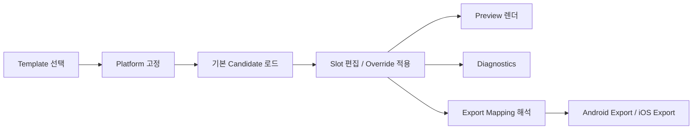

# 카카오톡 테마 메이커 데이터 모델 / 폴더 구조 설계안

## 설계 목표

- 템플릿, 플랫폼, 슬롯, 후보, 업로드, export를 하나의 모델로 묶는다.
- 미리보기와 export가 같은 소스를 바라보게 만든다.
- 템플릿이 늘어나도 코드 수정 범위를 제한한다.

## 상위 개념

현재 서비스는 아래 6개 개념으로 정리하는 것이 적절하다.

1. `Template`
2. `Platform`
3. `Section`
4. `Slot`
5. `Candidate`
6. `Override`

추가로 export 시점에는 아래 개념이 필요하다.

7. `ExportMapping`
8. `Diagnostics`

## 권장 데이터 모델

### Template

템플릿은 제작 시작점이다.

필수 필드:

```ts
type ThemeTemplate = {
  id: string;
  name: string;
  description?: string;
  thumbnail?: string;
  supportedPlatforms: ThemePlatform[];
  defaults: ThemeTemplateDefaults;
  sections: ThemeSectionDefinition[];
};
```

역할:

- 시작 화면 카드 정보
- 기본 에셋/기본 색상 공급
- 섹션/슬롯 구조 연결

### Platform

플랫폼은 UI에서는 숨기더라도 내부 구조상 명확해야 한다.

```ts
type ThemePlatform = "android" | "ios";
```

역할:

- 파일명 규칙
- 이미지 스케일 규칙
- 미리보기 해석 방식
- export 방식 분기

### Section

사용자가 인지하는 편집 단위다.

1차 MVP 기준:

```ts
type ThemeSection = "main" | "tabs" | "chatroom";
```

향후 확장:

```ts
type ThemeSection =
  | "main"
  | "tabs"
  | "chatroom"
  | "profile"
  | "more"
  | "passcode"
  | "notification";
```

### Group

섹션 안에서 슬롯을 묶는 단위다.

예시:

- `main/background`
- `main/header`
- `main/list`
- `tabs/bar`
- `tabs/icons`
- `chatroom/background`
- `chatroom/bubbles`
- `chatroom/input`

```ts
type ThemeSlotGroup =
  | "background"
  | "header"
  | "list"
  | "bar"
  | "icons"
  | "bubbles"
  | "input";
```

### Slot

실제 편집 대상이다.

```ts
type ThemeAssetSlot = {
  id: string;
  role: ThemeResourceRole;
  section: ThemeSection;
  group: ThemeSlotGroup;
  platform: ThemePlatform | "shared";
  kind: ThemeSlotKind;
  label: string;
  required: boolean;
  candidates?: Partial<Record<ThemeTemplateId, ThemeSlotCandidate[]>>;
  export?: Partial<Record<ThemePlatform, ThemeExportMapping>>;
};
```

핵심 원칙:

- 슬롯은 반드시 기본 candidate를 가져야 한다.
- 슬롯은 preview와 export에서 같은 `role`을 기준으로 해석한다.
- 슬롯은 `image`, `ninepatch`, `color`를 공통 구조로 가져간다.

### Candidate

candidate는 슬롯에 들어갈 수 있는 기본 소스다.

```ts
type ThemeSlotCandidate = {
  id: string;
  label: string;
  sourceType: "template-asset" | "template-color" | "session-upload";
  assetUrl?: string;
  colorValue?: string;
  previewUrl?: string;
  metadata?: {
    width?: number;
    height?: number;
    scale?: "@2x" | "@3x";
  };
};
```

원칙:

- 기본 템플릿은 모든 슬롯이 candidate를 하나 이상 가진 상태로 시작한다.
- 사용자가 업로드한 파일도 세션 내에서는 candidate로 유지한다.
- candidate 선택은 소스 전환이고, 업로드 삭제와는 별개여야 한다.

### Override

override는 현재 세션에서 선택하거나 수정한 값이다.

```ts
type SlotOverrideState = {
  candidateSelections: Record<string, string | undefined>;
  colorOverrides: Record<string, string | undefined>;
  uploads: Record<string, SlotUploadEntry[] | undefined>;
  bubbleEdits: Partial<Record<BubbleSlot, BubbleEditState>>;
};
```

역할:

- 템플릿 기본값을 직접 수정하지 않는다.
- 현재 프로젝트의 편집 결과만 따로 쌓는다.

### ExportMapping

슬롯을 실제 플랫폼 파일명이나 CSS 키에 연결하는 정보다.

```ts
type ThemeExportMapping = {
  type: "file" | "css-image" | "css-color" | "config";
  target: string;
  scaleTargets?: string[];
  transform?: "copy" | "render-9patch" | "resize" | "write-css";
};
```

예시:

- Android `bubble_me_1`
  - `src/main/theme/drawable-xxhdpi/theme_chatroom_bubble_me_01_image.9.png`
- iOS `bubble_me_1`
  - `Images/chatroomBubbleSend01@2x.png`
  - `Images/chatroomBubbleSend01@3x.png`
  - `KakaoTalkTheme.css` inset 설정

### Diagnostics

진단은 export 이전의 검수 모델이다.

```ts
type ThemeDiagnostic = {
  level: "error" | "warning" | "info";
  slotId?: string;
  code: string;
  message: string;
  fixHint?: string;
};
```

예시:

- 필수 슬롯 누락
- Android invalid 9-patch border
- iOS `@2x/@3x` 누락
- export target 중복

## 권장 런타임 흐름



## 권장 폴더 구조

현재 구조를 크게 흔들지 않고, 아래 방향으로 정리하는 것이 적절하다.

```text
app/
  page.tsx
  template/page.tsx
  edit/page.tsx
  editor/page.tsx

components/
  template/
  project/
  editor/
  preview/
  diagnostics/
  export/

lib/
  theme/
    types.ts
    templates.ts
    manifest/
      basic.android.json
      basic.ios.json
    android/
      ninepatch.ts
      export.ts
      diagnostics.ts
    ios/
      insets.ts
      export.ts
      diagnostics.ts
    preview/
      resolve.ts
      layout.ts
    project/
      detect.ts
      types.ts
      state.ts
      export.ts
      diagnostics.ts

public/
  template-assets/
    basic/
      android/
      ios/

docs/
  roadmap.md
  theme-architecture.md
  ux-flow.md
  migration-plan.md
```

## manifest 분리 이유

현재는 `templates.ts`에 템플릿 구조와 기본값이 함께 들어 있다.  
초기에는 괜찮지만, 템플릿 수가 늘면 아래 문제가 생긴다.

- 코드 파일이 너무 커진다.
- 플랫폼별 파일 매핑이 섞인다.
- 에셋 운영과 UI 로직이 분리되지 않는다.

그래서 중기적으로는 아래 분리를 추천한다.

- `templates.ts`
  - 템플릿 메타 목록
  - 공용 타입
- `manifest/*.json`
  - 슬롯 정의
  - 기본 candidate
  - export mapping

## 편집 상태 저장 구조

저장 포맷은 아래 정도가 적절하다.

```ts
type ThemeProjectState = {
  version: 1;
  templateId: ThemeTemplateId;
  platform: ThemePlatform;
  selectedSection: ThemeSection;
  selectedGroup?: ThemeSlotGroup;
  selectedSlotId?: string;
  candidateSelections: Record<string, string | undefined>;
  colorOverrides: Record<string, string | undefined>;
  bubbleEdits: Partial<Record<BubbleSlot, BubbleEditState>>;
  uploads: Record<string, SlotUploadEntry[] | undefined>;
};
```

원칙:

- 템플릿 기본값은 저장하지 않아도 재구성 가능해야 한다.
- 저장 상태는 override 위주로 작게 유지한다.
- export 시점에는 저장 상태 + 템플릿 manifest를 합성한다.

## 구현 순서 추천

1. `ThemeExportMapping` 타입 추가
2. 템플릿별 manifest 초안 도입
3. diagnostics 모델 추가
4. Android export 구현
5. iOS export 구현

## DB 도입 판단

현재 단계에서는 DB보다 manifest + 정적 에셋 구조가 더 적절하다.

DB가 필요한 시점:

- 템플릿 수가 많아짐
- candidate 검색/태그/분류가 필요함
- 여러 제작자가 같은 라이브러리를 공유함
- 업로드 자산을 장기 보관해야 함

그 전까지는 아래 조합이면 충분하다.

- `public/template-assets`
- `manifest/*.json`
- 로컬 세션 저장

## 결론

이 프로젝트는 앞으로 `이미지 업로드 편집기`가 아니라 `테마 프로젝트 편집기`로 가야 한다.  
그 기준에서 핵심은 아래 4가지다.

1. 슬롯마다 기본 candidate가 있어야 한다.
2. 편집 결과는 override로 쌓여야 한다.
3. preview와 export는 같은 모델을 바라봐야 한다.
4. 템플릿 정의와 에셋 운영은 manifest 중심으로 분리해야 한다.
